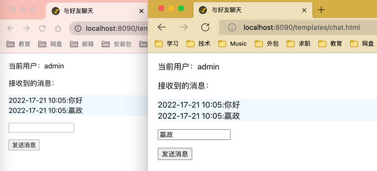

# 介绍

资源正在持续更新中...

内容不详细一一列举，有需要可直接看代码，后续待完善后会做一期视频详细演示！！！

代码里包含详细的代码示例，不懂之处可以在代码中体会理解！！！

有任何疑问和意见可以在issues提问;  QQ群讨论：779146205

common：常用工具类

java8: java基础和Java8新特性

java11： Java11新特性

leetcode：leetcode题目案例、面试总结、整理阿里、腾讯、京东、百度等大厂面试题

spring-boot-aliyun：整合了阿里云短信、阿里云视频点播、阿里云OSS对象存储

happy-chat：基于Netty聊天室

spring-boot-rabbitmq：springboot整合rabbit

spring-boot-thymeleaf：springboot整合thymeleaf，生成静态页，实用工具类（文件处理，邮件发送，EasyPOI导入导出）

spring-boot-tool：pdf转word工具，文件上传

spring-boot-starter：自定义starter demo

spring-cloud-alibaba：微服务案例

｜- eureka-server：集成了eureka，目前使用的nacos，eureka相关配置暂时被屏蔽了，如需使用调整注释中配置信息即可

｜- feign-api：整合了feign远程调用组件

｜- gateway：整合了spring cloud gateway

｜- order-service：订单服务demo

｜- user-service：用户服务demo

｜- doc：sql脚本、nacos文档、使用说明

｜- spring-boot-admin-server：服务监控指标

spring-cloud-gateway包含过滤器

通过网关访问方式：http://localhost:10010/order/102?authorization=admin

服务监控指标：http://localhost:10000/applications

软考资源 

# 项目案例

## 项目一：reggie-take-out：外卖项目案例

项目描述：

1.springboot、mybatis plus、redis

2.单体项目

3.上传与下载

4.管理后台：http://localhost:8080/backend/index.html

  APP：http://localhost:8080/front/index.html

  swagger接口文档：http://localhost:8080/doc.html

5.适合小白的项目，刚参加工作可做参考

6.Linux文档
<a href="https://github.com/lzhjavagithub/JavaStudy/blob/master/reggie-take-out/doc/linux.md">Linux部署文档1</a>

<a href="https://github.com/lzhjavagithub/JavaStudy/blob/master/reggie-take-out/doc/Linux%E9%83%A8%E7%BD%B2%E6%96%87%E6%A1%A3.md">Linux部署文档2</a>

## 项目二：happy-chat：Netty聊天室
访问地址：http://localhost:8090/templates/chat.html

# Github使用小技巧

Edge/Chrome插件：Octotree

使用了 Octotree 之后网页侧边栏会按照树形结构展示项目，可以提高GitHub阅读代码效率

## Git使用

<a href="https://github.com/lzhjavagithub/JavaStudy/blob/master/doc/git/git.md">Git常用操作</a>

# 代码导航

具体可以根据自己的业务场景简单修改

<a href="https://github.com/lzhjavagithub/JavaStudy/blob/master/spring-boot-tool/src/main/java/com/xiaomi/controller/FileController.java">
PDF转word</a>

<a href="https://github.com/lzhjavagithub/JavaStudy/blob/master/spring-boot-tool/src/main/java/com/xiaomi/controller/UploadController.java">
文件上传</a>

<a href="https://github.com/lzhjavagithub/JavaStudy/blob/master/spring-boot-thymeleaf/src/main/java/com/xiaomi/controller/MeetingController.java">
使用thymeleaf生成静态页（可以根据自己的业务场景自行调整）</a>

<a href="https://github.com/lzhjavagithub/JavaStudy/blob/master/spring-boot-thymeleaf/src/main/java/com/xiaomi/util/TemplateUtil.java">
使用thymeleaf生成静态页工具类</a>

<a href="https://github.com/lzhjavagithub/JavaStudy/blob/master/spring-boot-thymeleaf/src/main/java/com/xiaomi/controller/ToolController.java">
实用工具：easypoi导入导出、文件批量操作、生成二维码、发送邮件，</a>

<a href="https://github.com/lzhjavagithub/JavaStudy/blob/master/spring-boot-aliyun/src/main/java/com/xiaomi/controller/SmsController.java">
阿里云短信服务</a>

<a href="https://github.com/lzhjavagithub/JavaStudy/blob/master/spring-boot-aliyun/src/main/java/com/xiaomi/controller/OssController.java">
阿里云OSS对象存储</a>

<a href="https://github.com/lzhjavagithub/JavaStudy/blob/master/spring-boot-aliyun/src/main/java/com/xiaomi/controller/VodController.java">
阿里云视频点播</a>

<a href="https://github.com/lzhjavagithub/JavaStudy/tree/master/java8/src/main/java/com/xiaomi">Java8新特性整理</a>

<a href="https://github.com/lzhjavagithub/JavaStudy/tree/master/doc">大厂面试题、常用知识点整理</a>

<a href="https://github.com/lzhjavagithub/JavaStudy/tree/master/common/src/main/java/com/alibaba/util">实用工具类</a>

<a href="https://github.com/lzhjavagithub/JavaStudy/blob/master/spring-cloud-alibaba/pom.xml">Spring Cloud
Alibaba微服务案例</a>

<a href="https://github.com/lzhjavagithub/JavaStudy/tree/master/%E8%BD%AF%E8%80%83%E9%AB%98%E7%BA%A7-%E7%B3%BB%E7%BB%9F%E6%9E%B6%E6%9E%84%E8%AE%BE%E8%AE%A1%E5%B8%88%E8%B5%84%E6%96%99">
软考高级资料：系统架构设计师</a>

<a href="https://github.com/lzhjavagithub/JavaStudy/blob/master/spring-boot-redis-dianping/src/main/java/com/github/utils/RedisCacheUtils.java">
Redis工具类</a>

<a href="https://github.com/lzhjavagithub/JavaStudy/blob/master/spring-boot-redis-dianping/src/main/java/com/github/utils/RegexUtils.java">
正则表达式工具类
</a>

# Java
## 基础&新特性

  <a href="https://github.com/lzhjavagithub/JavaStudy/blob/master/java8/src/main/resources/java-basic-01.md">
  Java基础常见知识点&面试题总结(1)
  </a>

  <a href="https://github.com/lzhjavagithub/JavaStudy/blob/master/java8/src/main/resources/java-basic-02.md">
  Java基础常见知识点&面试题总结(2)
  </a>

  <a href="https://github.com/lzhjavagithub/JavaStudy/blob/master/java8/src/main/resources/java-basic-03.md">
  Java基础常见知识点&面试题总结(3)
  </a>

<a href="https://github.com/lzhjavagithub/JavaStudy/blob/master/java8/src/main/resources/java-8.md">
  Java8新特性.md</a>

<a href="https://github.com/lzhjavagithub/JavaStudy/blob/master/java8/src/main/resources/JDK8%E6%96%B0%E7%89%B9%E6%80%A7.pdf">
  Java8新特性.pdf</a>

<a href="https://github.com/lzhjavagithub/JavaStudy/blob/master/java11/doc/java9.md">
  Java9新特性</a>

<a href="https://github.com/lzhjavagithub/JavaStudy/blob/master/java11/doc/java10.md">
  Java10新特性</a>

<a href="https://github.com/lzhjavagithub/JavaStudy/blob/master/java11/doc/JDK11%26JDK12%E6%96%B0%E7%89%B9%E6%80%A7%E8%AF%A6%E8%A7%A3.pdf">
  Java11&12新特性PDF</a>

<a href="https://github.com/lzhjavagithub/JavaStudy/blob/master/java11/doc/java11.md">
  Java11新特性</a>

<a href="https://github.com/lzhjavagithub/JavaStudy/blob/master/java11/doc/java12-13.md">
  Java12&13新特性</a>

<a href="https://github.com/lzhjavagithub/JavaStudy/blob/master/java11/doc/java14-15.md">
  Java14&15新特性</a>

## 集合

<a href="https://github.com/lzhjavagithub/JavaStudy/blob/master/leetcode/src/main/resources/%E9%9D%A2%E8%AF%95%E6%80%BB%E7%BB%93/Java%E9%9B%86%E5%90%88%E5%B8%B8%E8%A7%81%E7%9F%A5%E8%AF%86%E7%82%B9%26%E9%9D%A2%E8%AF%95%E9%A2%98%E6%80%BB%E7%BB%93(2).md">
  Java集合常见知识点&面试题总结(2)</a>

<a href="https://github.com/lzhjavagithub/JavaStudy/blob/master/leetcode/src/main/resources/%E9%9D%A2%E8%AF%95%E6%80%BB%E7%BB%93/Java%E9%9B%86%E5%90%88%E5%B8%B8%E8%A7%81%E7%9F%A5%E8%AF%86%E7%82%B9%26%E9%9D%A2%E8%AF%95%E9%A2%98%E6%80%BB%E7%BB%93(1).md">
  Java集合常见知识点&面试题总结(1)</a>

<a href="https://github.com/lzhjavagithub/JavaStudy/blob/master/leetcode/src/main/resources/%E9%9D%A2%E8%AF%95%E6%80%BB%E7%BB%93/Java%E9%9B%86%E5%90%88%E4%BD%BF%E7%94%A8%E6%B3%A8%E6%84%8F%E4%BA%8B%E9%A1%B9%E6%80%BB%E7%BB%93.md">
  Java集合使用注意事项总结
  </a>

## 重要知识点

<a href="https://github.com/lzhjavagithub/JavaStudy/blob/master/leetcode/src/main/resources/%E9%9D%A2%E8%AF%95%E6%80%BB%E7%BB%93/%E5%8F%8D%E5%B0%84%E6%9C%BA%E5%88%B6.md">
  反射机制</a>

<a href="https://github.com/lzhjavagithub/JavaStudy/blob/master/leetcode/src/main/resources/%E9%9D%A2%E8%AF%95%E6%80%BB%E7%BB%93/%E4%B8%BA%E4%BB%80%E4%B9%88%20Java%20%E4%B8%AD%E5%8F%AA%E6%9C%89%E5%80%BC%E4%BC%A0%E9%80%92.md">
  为什么 Java 中只有值传递</a>

<a href="https://github.com/lzhjavagithub/JavaStudy/blob/master/leetcode/src/main/resources/%E9%9D%A2%E8%AF%95%E6%80%BB%E7%BB%93/%E5%9F%BA%E7%A1%80%E7%AF%87%E8%AE%B2%E4%B9%89.md">
  算法篇：二分查找、排序、设计模式等</a>

<a href="https://github.com/lzhjavagithub/JavaStudy/blob/master/leetcode/src/main/resources/%E9%9D%A2%E8%AF%95%E6%80%BB%E7%BB%93/BigDecimal%E8%A7%A3%E5%86%B3%E6%B5%AE%E7%82%B9%E6%95%B0%E8%BF%90%E7%AE%97%E7%B2%BE%E5%BA%A6%E4%B8%A2%E5%A4%B1%E9%97%AE%E9%A2%98.md">
  BigDecimal解决浮点数运算精度丢失问题
  </a>

## 常用框架

### Spring

<a href="https://github.com/lzhjavagithub/JavaStudy/blob/master/leetcode/src/main/resources/%E9%9D%A2%E8%AF%95%E6%80%BB%E7%BB%93/SpringBoot%E5%B8%B8%E7%94%A8%E6%B3%A8%E8%A7%A3%E6%80%BB%E7%BB%93.md">
  SpringBoot常用注解总结.md</a>

<a href="https://github.com/lzhjavagithub/JavaStudy/blob/master/leetcode/src/main/resources/%E9%9D%A2%E8%AF%95%E6%80%BB%E7%BB%93/springboot%E8%87%AA%E5%8A%A8%E8%A3%85%E9%85%8D%E5%8E%9F%E7%90%86.md">
  SpringBoot自动装配原理</a>

<a href="https://github.com/lzhjavagithub/JavaStudy/blob/master/leetcode/src/main/resources/%E9%9D%A2%E8%AF%95%E6%80%BB%E7%BB%93/Spring%E4%BA%8B%E5%8A%A1%E6%80%BB%E7%BB%93.md">
  Spring事务总结</a>

<a href="https://github.com/lzhjavagithub/JavaStudy/blob/master/leetcode/src/main/resources/%E9%9D%A2%E8%AF%95%E6%80%BB%E7%BB%93/Spring%E8%AE%BE%E8%AE%A1%E6%A8%A1%E5%BC%8F%E6%80%BB%E7%BB%93.md">
  Spring设计模式总结</a>

### SpringCloud

<a href="https://github.com/lzhjavagithub/JavaStudy/blob/master/spring-cloud-alibaba/doc/springcloud/springcloud-intro.md">
Spring Cloud 入门
</a>

<a href="https://github.com/lzhjavagithub/JavaStudy/blob/master/spring-cloud-alibaba/doc/SpringCloud%E5%AE%9E%E7%94%A8%E7%AF%8701.md">
  SpringCloud、Eureka注册中心、Ribbon负载均衡、Nacos注册中心
</a>

<a href="https://github.com/lzhjavagithub/JavaStudy/blob/master/spring-cloud-alibaba/doc/SpringCloud%E5%AE%9E%E7%94%A8%E7%AF%8702.md">
  Nacos配置管理、Feign远程调用、SpringCloud Gateway服务网关
</a>

<a href="https://github.com/lzhjavagithub/JavaStudy/blob/master/spring-cloud-alibaba/doc/nacos%E9%9B%86%E7%BE%A4%E6%90%AD%E5%BB%BA.md">
  nacos集群搭建</a>

<a href="https://github.com/lzhjavagithub/JavaStudy/blob/master/spring-cloud-alibaba/doc/Nacos%E5%AE%89%E8%A3%85%E6%8C%87%E5%8D%97.md">
  Nacos安装指南</a>

<a href="https://github.com/lzhjavagithub/JavaStudy/blob/master/spring-cloud-alibaba/doc/sentinel%E8%A7%84%E5%88%99%E6%8C%81%E4%B9%85%E5%8C%96.md">
  Sentinel 规则持久化</a>

<a href="https://github.com/lzhjavagithub/JavaStudy/blob/master/spring-cloud-alibaba/doc/%E5%BE%AE%E6%9C%8D%E5%8A%A1%E4%BF%9D%E6%8A%A4.md">
  微服务保护 Sentinel</a>

<a href="https://github.com/lzhjavagithub/JavaStudy/blob/master/spring-cloud-alibaba/doc/Jmeter%E5%BF%AB%E9%80%9F%E5%85%A5%E9%97%A8.md">
  Jmeter使用</a>

## 并发

<a href="https://github.com/lzhjavagithub/JavaStudy/blob/master/juc/src/main/resources/%E9%9D%A2%E8%AF%95%E6%80%BB%E7%BB%93/%E5%B9%B6%E5%8F%91%E7%AF%87%E8%AE%B2%E4%B9%89.md">
  并发篇讲义 JUC、多线程
  </a>

<a href="https://github.com/lzhjavagithub/JavaStudy/blob/master/java-nio/nio-demo/src/main/resources/%E8%AF%BE%E4%BB%B6/01_%E5%B0%9A%E7%A1%85%E8%B0%B7_Java%20NIO_%E8%AF%BE%E4%BB%B6_V1.0.pdf">
  Java NIO网络编程</a>

# 高性能

## 负载均衡

<a href="https://github.com/lzhjavagithub/JavaStudy/blob/master/doc/high-mq/load-balancing.md">负载均衡</a>

<a href="https://github.com/lzhjavagithub/JavaStudy/blob/master/doc/high-mq/read-and-write-separation-and-library-subtable.md">读写分离&分库分表</a>

# 数据库

## MySql

<a href="https://github.com/lzhjavagithub/JavaStudy/blob/master/doc/database/basis.md">数据库基础知识</a>

<a href="https://github.com/lzhjavagithub/JavaStudy/blob/master/doc/database/character-set.md">MySQl字符集</a>

<a href="https://github.com/lzhjavagithub/JavaStudy/blob/master/doc/database/mysql/a-thousand-lines-of-mysql-study-notes.md">
一千行MySQL学习笔记</a>

<a href="https://github.com/lzhjavagithub/JavaStudy/blob/master/doc/database/mysql/how-sql-executed-in-mysql.md">
一条SQL语句在 MySQL 中如何被执行的?</a>

<a href="https://github.com/lzhjavagithub/JavaStudy/blob/master/doc/database/mysql/innodb-implementation-of-mvcc.md">
InnoDB存储引擎对MVCC的实现</a>

<a href="https://github.com/lzhjavagithub/JavaStudy/blob/master/doc/database/mysql/mysql-high-performance-optimization-specification-recommendations.md">
MySQL 高性能优化规范建议</a>

<a href="https://github.com/lzhjavagithub/JavaStudy/blob/master/doc/database/mysql/mysql-index.md">MySQL 索引详解</a>

<a href="https://github.com/lzhjavagithub/JavaStudy/blob/master/doc/database/mysql/mysql-logs.md">MySQL三大日志(binlog、redo
log和undo log)详解</a>

<a href="https://github.com/lzhjavagithub/JavaStudy/blob/master/doc/database/mysql/mysql-questions-01.md">
MySQL知识点&面试题总结</a>

<a href="https://github.com/lzhjavagithub/JavaStudy/blob/master/doc/database/mysql/some-thoughts-on-database-storage-time.md">
关于数据库中如何存储时间的一点思考</a>

<a href="https://github.com/lzhjavagithub/JavaStudy/blob/master/doc/database/mysql/transaction-isolation-level.md">
事务隔离级别(图文详解)</a>

## Redis

<a href="https://github.com/lzhjavagithub/JavaStudy/blob/master/doc/database/Redis/3-commonly-used-cache-read-and-write-strategies.md">
3种常用的缓存读写策略</a>

<a href="https://github.com/lzhjavagithub/JavaStudy/blob/master/doc/database/Redis/redis-memory-fragmentation.md">Redis
内存碎片</a>

<a href="https://github.com/lzhjavagithub/JavaStudy/blob/master/doc/database/Redis/redis-questions-01.md">
Redis知识点&面试题总结</a>

<a href="https://blog.csdn.net/qq_30398499/article/details/125098510?spm=1001.2014.3001.5501" target="_blank">Redis哨兵详解</a>

<a href="https://blog.csdn.net/qq_30398499/article/details/125098696?spm=1001.2014.3001.5501" target="_blank">Redis安装</a>

<a href="https://blog.csdn.net/qq_30398499/article/details/125103454?spm=1001.2014.3001.5501" target="_blank">Redis分片集群搭建</a>

# 消息队列

## RabbitMQ

<a href="https://github.com/lzhjavagithub/JavaStudy/blob/master/spring-boot-rabbitmq/doc/RabbitMQ.md">RabbitMQ</a>

<a href="https://github.com/lzhjavagithub/JavaStudy/blob/master/spring-boot-rabbitmq/doc/RabbitMQ%E9%83%A8%E7%BD%B2%E6%8C%87%E5%8D%97.md">
RabbitMQ部署指南.md</a>

<a href="https://github.com/lzhjavagithub/JavaStudy/blob/master/spring-boot-rabbitmq/doc/rabbitmq-intro.md">
RabbitMQ入门、面试总结</a>

<a href="https://github.com/lzhjavagithub/JavaStudy/blob/master/spring-boot-rabbitmq/doc/RabbitMQ-%E9%AB%98%E7%BA%A7%E7%AF%87.md">
RabbitMQ服务异步通信 高级篇
</a>

## Kafka

<a href="https://github.com/lzhjavagithub/JavaStudy/blob/master/doc/high-mq/message-queue/kafka-questions-01.md">Kafka知识点&面试题总结</a>

<a href="https://github.com/lzhjavagithub/JavaStudy/blob/master/doc/high-mq/message-queue/message-queue.md">消息队列知识点&面试题总结</a>

## RocketMQ

<a href="https://github.com/lzhjavagithub/JavaStudy/blob/master/doc/high-mq/message-queue/rocketmq-intro.md">RocketMQ入门总结</a>

<a href="https://github.com/lzhjavagithub/JavaStudy/blob/master/doc/high-mq/message-queue/rocketmq-questions.md">RocketMQ常见问题</a>

# JVM

<a href="https://github.com/lzhjavagithub/JavaStudy/blob/master/doc/jvm/class-file-structure.md">类文件结构详解</a>

<a href="https://github.com/lzhjavagithub/JavaStudy/blob/master/doc/jvm/class-loading-process.md">类加载过程详解</a>

<a href="https://github.com/lzhjavagithub/JavaStudy/blob/master/doc/jvm/classloader.md">类加载器详解</a>

<a href="https://github.com/lzhjavagithub/JavaStudy/blob/master/doc/jvm/java-jvm-questions-01.md">Java 内存区域</a>

<a href="https://github.com/lzhjavagithub/JavaStudy/blob/master/doc/jvm/jdk-monitoring-and-troubleshooting-tools.md">JDK 监控和故障处理工具总结</a>

<a href="https://github.com/lzhjavagithub/JavaStudy/blob/master/doc/jvm/jvm-garbage-collection.md">JVM 垃圾回收详解</a>

<a href="https://github.com/lzhjavagithub/JavaStudy/blob/master/doc/jvm/jvm-intro.md">大白话带你认识JVM</a>

<a href="https://github.com/lzhjavagithub/JavaStudy/blob/master/doc/jvm/jvm-parameters-intro.md">最重要的 JVM 参数总结</a>

<a href="https://github.com/lzhjavagithub/JavaStudy/blob/master/doc/jvm/memory-area.md">Java 内存区域详解</a>

# 多线程

<a href="https://github.com/lzhjavagithub/JavaStudy/blob/master/doc/concurrent/aqs.md">AQS 原理以及 AQS 同步组件总结</a>

<a href="https://github.com/lzhjavagithub/JavaStudy/blob/master/doc/concurrent/atomic-classes.md">Atomic 原子类总结</a>

<a href="https://github.com/lzhjavagithub/JavaStudy/blob/master/doc/concurrent/completablefuture-intro.md">CompletableFuture入门</a>

<a href="https://github.com/lzhjavagithub/JavaStudy/blob/master/doc/concurrent/java-concurrent-collections.md">Java 常见并发容器总结</a>

<a href="https://github.com/lzhjavagithub/JavaStudy/blob/master/doc/concurrent/java-concurrent-questions-01.md">Java 并发常见知识点&面试题总结（基础篇）</a>

<a href="https://github.com/lzhjavagithub/JavaStudy/blob/master/doc/concurrent/java-concurrent-questions-02.md">Java 并发常见知识点&面试题总结（进阶篇）</a>

<a href="https://github.com/lzhjavagithub/JavaStudy/blob/master/doc/concurrent/java-thread-pool-best-practices.md">Java 线程池最佳实践</a>

<a href="https://github.com/lzhjavagithub/JavaStudy/blob/master/doc/concurrent/java-thread-pool-summary.md">Java 线程池详解</a>

<a href="https://github.com/lzhjavagithub/JavaStudy/blob/master/doc/concurrent/reentrantlock.md">从ReentrantLock的实现看AQS的原理及应用</a>

<a href="https://github.com/lzhjavagithub/JavaStudy/blob/master/doc/concurrent/threadlocal.md">万字解析 ThreadLocal 关键字</a>

# 开源项目精选

  <a href="https://github.com/yangzongzhuan/RuoYi">
    ruoyi单体</a>：一直想做一款后台管理系统，看了很多优秀的开源项目但是发现没有合适的。于是利用空闲休息时间开始自己写了一套后台系统。如此有了若依。她可以用于所有的Web应用程序，如网站管理后台，网站会员中心，CMS，CRM，OA。所有前端后台代码封装过后十分精简易上手，出错概率低。同时支持移动客户端访问。系统会陆续更新一些实用功能。

  <a href="https://github.com/yangzongzhuan/RuoYi-Vue">
    ruoyi-vue前后端分离</a>

  <a href="https://github.com/yangzongzhuan/RuoYi-Cloud">ruoyi微服务</a>

  <a href="https://github.com/macrozheng/mall">
    mall项目是一套电商系统
  </a>：包括前台商城系统及后台管理系统，基于SpringBoot+MyBatis实现，采用Docker容器化部署。前台商城系统包含首页门户、商品推荐、商品搜索、商品展示、购物车、订单流程、会员中心、客户服务、帮助中心等模块。后台管理系统包含商品管理、订单管理、会员管理、促销管理、运营管理、内容管理、统计报表、财务管理、权限管理、设置等模块。

  <a href="https://github.com/macrozheng/mall-swarm">mall-swarm是一套微服务商城系统
  </a>：采用了 Spring Cloud Hoxton & Alibaba、Spring Boot 2.3、Oauth2、MyBatis、Elasticsearch、Docker、Kubernetes等核心技术，同时提供了基于Vue的管理后台方便快速搭建系统。mall-swarm在电商业务的基础集成了注册中心、配置中心、监控中心、网关等系统功能。文档齐全，附带全套Spring Cloud教程。

  <a href="https://github.com/macrozheng/mall-learning">
  mall学习教程</a>：架构、业务、技术要点全方位解析。mall项目（40k+star）是一套电商系统，使用现阶段主流技术实现。涵盖了SpringBoot 2.3.0、MyBatis 3.4.6、Elasticsearch 7.6.2、RabbitMQ 3.7.15、Redis 5.0、MongoDB 4.2.5、Mysql5.7等技术，采用Docker容器化部署。

  <a href="https://github.com/wuyouzhuguli/SpringAll">
    Spring 系列教程</a>：该仓库为个人博客https://mrbird.cc中Spring系列源码，包含Spring Boot、Spring Boot & Shiro、Spring Cloud，Spring Boot & Spring Security & Spring Security OAuth2，如果该系列教程对您有帮助的话，还请点个star给予精神支持！

# 关于作者

本人大专学历+网络教育本科学历，5年+Java开发经验，平时工作中的学习笔记和开发经验总结归纳，涵盖了Java基础、并发、多线程、高性能、高可用、数据库、redis、数据结构和算法、设计模式、互联网大厂面试经验和面试题

我在大二期间一直坚持每天在csdn写博客，那时候就是随意地在博客平台上发发自己的学习笔记和自己写的程序，积累学习经验和开发经验，将我认为好的资源、学习经验和开发经验向大家分享;

身边也有很多小伙伴经常问我：“我现在写博客还晚么？”

我觉得哈！如果你想做什么事情，尽量少问迟不迟，多问自己值不值得，只要你觉得有意义，就尽快开始做吧！人生很奇妙，我们每一步的重大决定，都会对自己未来的人生轨迹产生影响。是好还是坏，也只有我们自己知道了！

对我自己来说，坚持写博客这一项决定对我人生轨迹产生的影响是非常正面的！所以，我也推荐大家养成坚持写博客的习惯。

# 友情链接

<a href="https://blog.csdn.net/qq_30398499?spm=1000.2115.3001.5343">CSDN博客</a>

