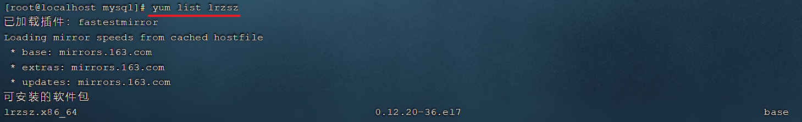
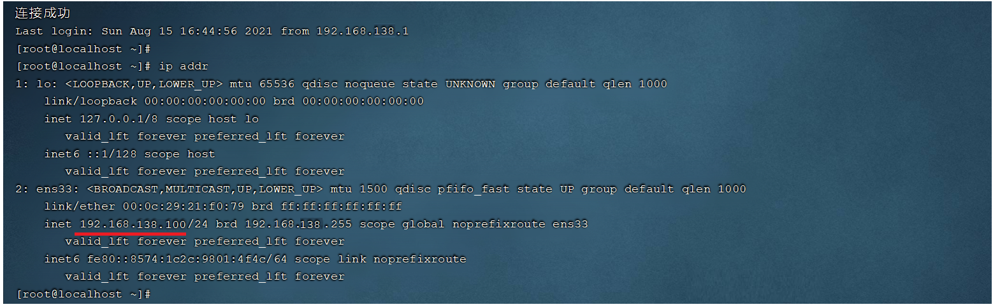

#  Linux部署文档

## 1. 软件安装

### 1.1 软件安装方式

在Linux系统中，安装软件的方式主要有四种，这四种安装方式的特点如下：

| 安装方式         | 特点                                                         |
| ---------------- | ------------------------------------------------------------ |
| 二进制发布包安装 | 软件已经针对具体平台编译打包发布，只要解压，修改配置即可     |
| rpm安装          | 软件已经按照redhat的包管理规范进行打包，使用rpm命令进行安装，==不能自行解决库依赖问题== |
| yum安装          | 一种在线软件安装方式，本质上还是rpm安装，自动下载安装包并安装，安装过程中自动解决库依赖问题(安装过程需要联网) |
| 源码编译安装     | 软件以源码工程的形式发布，需要自己编译打包                   |


### 1.2 安装JDK

上述我们介绍了Linux系统软件安装的四种形式，接下来我们就通过第一种(二进制发布包)形式来安装JDK。 JDK对应的二进制发布包，在课程资料中已经提供，如下： 


JDK具体安装步骤如下： 

**1). 上传安装包**

使用FinalShell自带的上传工具将jdk的二进制发布包上传到Linux

 

由于上述在进行文件上传时，选择的上传目录为根目录 /，上传完毕后，我们执行指令 cd / 切换到根目录下，查看上传的安装包。

 


**2). 解压安装包**

执行如下指令，将上传上来的压缩包进行解压，并通过-C参数指定解压文件存放目录为 /usr/local。

```
tar -zxvf jdk-8u171-linux-x64.tar.gz -C /usr/local
```

 


**3). 配置环境变量**

使用vim命令修改/etc/profile文件，在文件末尾加入如下配置

```
JAVA_HOME=/usr/local/jdk1.8.0_171
PATH=$JAVA_HOME/bin:$PATH
```

具体操作指令如下: 

```
1). 编辑/etc/profile文件，进入命令模式
	vim /etc/profile

2). 在命令模式中，输入指令 G ， 切换到文件最后
	G

3). 在命令模式中输入 i/a/o 进入插入模式，然后切换到文件最后一行
	i

4). 将上述的配置拷贝到文件中
	JAVA_HOME=/usr/local/jdk1.8.0_171
	PATH=$JAVA_HOME/bin:$PATH
	
5). 从插入模式，切换到指令模式
	ESC
	
6). 按:进入底行模式，然后输入wq，回车保存
	:wq
```


**4). 重新加载profile文件**

为了使更改的配置立即生效，需要重新加载profile文件，执行命令:

```
source /etc/profile
```


**5). 检查安装是否成功**

```
java -version
```

 


### 1.3 安装Tomcat

#### 1.3.1 Tomcat安装

Tomcat的安装和上述JDK的安装采用相同的方式，都是使用二进制发布包的形式进行安装，在我们的资料目录下，也已经准备了Tomcat的安装包： 

 


具体安装步骤如下： 

**1). 上传安装包**

使用FinalShell自带的上传工具将Tomcat的二进制发布包上传到Linux(与前面上传JDK安装包步骤一致)。

 


**2). 解压安装包**

将上传上来的安装包解压到指定目录/usr/local下，执行命令为

```
tar -zxvf apache-tomcat-7.0.57.tar.gz -C /usr/local
```


**3). 启动Tomcat**

进入Tomcat的bin目录启动服务。执行命令为: 

```
cd /usr/local/apache-tomcat-7.0.57/

cd bin

sh startup.sh或者./startup.sh
```

 

 


#### 1.3.2 Tomcat进程查看

上述我们将Tomcat启动完成之后，并不能知道Tomcat是否正常运行，那么我们验证Tomcat启动是否成功，有多种方式，我们这里主要介绍常见的两种方式： 

**1). 查看启动日志**

Tomcat的启动日志输出在Tomcat的安装目录下的logs目录中，Tomcat的启动及运行日志文件名为 catalina.out，所以我们查看Tomcat启动日志，主要可以通过两条指令，如下： 

```
1). 分页查询Tomcat的日志信息
more /usr/local/apache-tomcat-7.0.57/logs/catalina.out

2). 查询日志文件尾部的50行记录
tail -50 /usr/local/apache-tomcat-7.0.57/logs/catalina.out
```

只要Tomcat在启动的过程中，日志输出没有报错，基本可以判定Tomcat启动成功了。


**2). 查询系统进程**

我们也可以通过Linux系统的查看系统进程的指令，来判定Tomcat进程是否存在，从而判定Tomcat是否启动。执行如下指令： 

```
ps -ef|grep tomcat
```

 

**说明:** 

- ==ps==命令是linux下非常强大的进程查看命令，通过ps -ef可以查看当前运行的所有进程的详细信息

- =="|"== 在Linux中称为管道符，可以将前一个命令的结果输出给后一个命令作为输入

- 使用ps命令查看进程时，经常配合管道符和查找命令 grep 一起使用，来查看特定进程


#### 1.3.3 防火墙操作

前面我们已经通过日志的方式及查看系统进程的方式，验证了Tomcat服务已经正常启动，接下来我们就可以尝试访问一下。访问地址：http://192.168.138.130:8080，我们发现是访问不到的。

 

那为什么tomcat启动成功了，但就是访问不到呢？原因就在于Linux系统的防火墙，系统安装完毕后，系统启动时，防火墙自动启动，防火墙拦截了所有端口的访问。接下来我们就需要学习一下，如何操作防火墙，具体指令如下： 

| 操作                         | 指令                                                         | 备注                 |
| ---------------------------- | ------------------------------------------------------------ | -------------------- |
| 查看防火墙状态               | systemctl status firewalld / firewall-cmd --state            |                      |
| 暂时关闭防火墙               | systemctl stop firewalld                                     |                      |
| 永久关闭防火墙(禁用开机自启) | systemctl disable firewalld                                  | ==下次启动,才生效==  |
| 暂时开启防火墙               | systemctl start firewalld                                    |                      |
| 永久开启防火墙(启用开机自启) | systemctl enable firewalld                                   | ==下次启动,才生效==  |
| 开放指定端口                 | firewall-cmd --zone=public --add-port=8080/tcp --permanent   | ==需要重新加载生效== |
| 关闭指定端口                 | firewall-cmd --zone=public --remove-port=8080/tcp --permanent | ==需要重新加载生效== |
| 立即生效(重新加载)           | firewall-cmd --reload                                        |                      |
| 查看开放端口                 | firewall-cmd --zone=public --list-ports                      |                      |

> 注意：
>
> ​	A. systemctl是管理Linux中服务的命令，可以对服务进行启动、停止、重启、查看状态等操作
>
> ​	B. firewall-cmd是Linux中专门用于控制防火墙的命令
>
> ​	C. 为了保证系统安全，服务器的防火墙不建议关闭


那么我们要想访问到Tomcat，就可以采取两种类型的操作：

**A. 关闭防火墙**

执行指令 : 

```
systemctl stop firewalld
```

关闭之后，再次访问Tomcat，就可以访问到了。

 

<font color='red'>注意: 上面我们也提到了，直接关闭系统的防火墙，是不建议的，因为这样会造成系统不安全。</font>


**B. 开放Tomcat的端口号8080**

执行指令: 

```
①. 先开启系统防火墙
systemctl start firewalld

②. 再开放8080端口号
firewall-cmd --zone=public --add-port=8080/tcp --permanent

③. 重新加载防火墙
firewall-cmd --reload
```

执行上述的操作之后，就开放了当前系统中的8080端口号，再次访问Tomcat。


#### 1.3.4 停止Tomcat

在Linux系统中，停止Tomcat服务的方式主要有两种： 

**1). 运行Tomcat提供的脚本文件**

在Tomcat安装目录下有一个bin目录，这个目录中存放的是tomcat的运行脚本文件，其中有一个脚本就是用于停止tomcat服务的。

 

我们可以切换到bin目录，并执行如下指令，来停止Tomcat服务：

```
sh shutdown.sh
./shutdown.sh
```


**2). 结束Tomcat进程**

我们可以先通过 `ps -ef|grep tomcat` 指令查看tomcat进程的信息，从进程信息中获取tomcat服务的进程号。然后通过kill -9 的形式，来杀死系统进程。

 

通过上述的指令，我们可以获取到tomcat的进程号为 79947。接下来，我们就可以通过指令 ，来杀死tomcat的进程 ：

```
kill -9 79947 
```

执行完上述指令之后，我们再访问Linux系统中的Tomcat，就访问不到了。

> 注意：
>
> ​	kill命令是Linux提供的用于结束进程的命令，-9表示强制结束


> 注意 ： 
>
> ​	虽然上述讲解的两种方式，都可以停止Tomcat服务，但是推荐使用第一种方式(./shutdown.sh)执行脚本来关闭tomcat服务，如果通过第一种方式停止不了tomcat了，这个时候，我们可以考虑使用第二种方式，强制杀死进程。


### 1.4 安装MySQL

#### 1.4.1 MySQL安装

对于MySQL数据库的安装，我们将要使用前面讲解的第二种安装方式rpm进行安装。那么首先我们先了解一下什么rpm？

> **RPM：**全称为 Red-Hat Package Manager，RPM软件包管理器，是红帽Linux用于管理和安装软件的工具。


我们要通过rpm，进行MySQL数据库的安装，主要的步骤如下：

**1). 检测当前系统是否安装过MySQL相关数据库**

需要通过rpm相关指令，来查询当前系统中是否存在已安装的mysql软件包，执行指令如下：

```
rpm -qa							查询当前系统中安装的所有软件
rpm -qa | grep mysql			查询当前系统中安装的名称带mysql的软件
rpm -qa | grep mariadb			查询当前系统中安装的名称带mariadb的软件
```

通过rpm -qa 查询到系统通过rpm安装的所有软件，太多了，不方便查看，所以我们可以通过管道符 | 配合着grep进行过滤查询。

 

通过查询，我们发现在当前系统中存在mariadb数据库，是CentOS7中自带的，而这个数据库和MySQL数据库是冲突的，所以要想保证MySQL成功安装，需要卸载mariadb数据库。


**2). 卸载现有的MySQL数据库**

在rpm中，卸载软件的语法为： 

```
rpm -e --nodeps  软件名称
```

那么，我们就可以通过指令，卸载 mariadb，具体指令为： 

```
rpm -e --nodeps  mariadb-libs-5.5.60-1.el7_5.x86_64
```

 

我们看到执行完毕之后， 再次查询 mariadb，就查不到了，因为已经被成功卸载了。


**3). 将资料中提供的MySQL安装包上传到Linux并解压**

A. 上传MySQL安装包

在课程资料中，提供的有MySQL的安装包 ，我们需要将该安装包上传到Linux系统的根目录 / 下面。

 

 


B. 解压到/usr/local/mysql

执行如下指令: 

```
mkdir /usr/local/mysql
tar -zxvf mysql-5.7.25-1.el7.x86_64.rpm-bundle.tar.gz -C /usr/local/mysql
```

 


**4). 安装顺序安装rpm安装包**

```shell
rpm -ivh mysql-community-common-5.7.25-1.el7.x86_64.rpm
rpm -ivh mysql-community-libs-5.7.25-1.el7.x86_64.rpm
rpm -ivh mysql-community-devel-5.7.25-1.el7.x86_64.rpm
rpm -ivh mysql-community-libs-compat-5.7.25-1.el7.x86_64.rpm
rpm -ivh mysql-community-client-5.7.25-1.el7.x86_64.rpm
yum install net-tools
rpm -ivh mysql-community-server-5.7.25-1.el7.x86_64.rpm
```


> 说明: 
>
> - 因为rpm安装方式，是不会自动处理依赖关系的，需要我们自己处理，所以对于上面的rpm包的安装顺序不能随意修改。
> - 安装过程中提示缺少net-tools依赖，使用yum安装(yum是一种在线安装方式，需要保证联网)
> - 可以通过指令(yum update)升级现有软件及系统内核

 


#### 1.4.2 MySQL启动

MySQL安装完成之后，会自动注册为系统的服务，服务名为mysqld。那么，我们就可以通过systemctl指令来查看mysql的状态、启动mysql、停止mysql。

```
systemctl status mysqld		查看mysql服务状态
systemctl start mysqld		启动mysql服务
systemctl stop mysqld		停止mysql服务
```


> 说明： 
>
> ​	可以设置开机时启动mysql服务，避免每次开机启动mysql。执行如下指令： 
>
> ​	systemctl enable mysqld


我们可以通过如下两种方式，来判定mysql是否启动：

```
netstat -tunlp					查看已经启动的服务
netstat -tunlp | grep mysql		查看mysql的服务信息

ps –ef | grep mysql				查看mysql进程
```

 

> <font color='red'>备注: </font>
>
> ​	<font color='red'>A. netstat命令用来打印Linux中网络系统的状态信息，可让你得知整个Linux系统的网络情况。</font>
>
> ​		参数说明: 
>
> ​		-l或--listening：显示监控中的服务器的Socket；
> ​		-n或--numeric：直接使用ip地址，而不通过域名服务器；
> ​		-p或--programs：显示正在使用Socket的程序识别码和程序名称；
> ​		-t或--tcp：显示TCP传输协议的连线状况；
> ​		-u或--udp：显示UDP传输协议的连线状况；
>
> ​	<font color='red'>B. ps命令用于查看Linux中的进程数据。</font>


#### 1.4.3 MySQL登录

##### 1.4.3.1 查阅临时密码

MySQL启动起来之后，我们就可以测试一下登录操作，但是我们要想登录MySQL，需要一个访问密码，而刚才在安装MySQL的过程中，并没有看到让我们设置访问密码，那这个访问密码是多少呢? 那实际上，对于rpm安装的mysql，在mysql第一次启动时，会自动帮我们生成root用户的访问密码，并且输出在mysql的日志文件 /var/log/mysqld.log中，我们可以查看这份日志文件，从而获取到访问密码。


可以执行如下指令：

1). cat /var/log/mysqld.log

 

这种方式，可以看到所有的日志数据，文件比较大时，很不方便查看数据。我们可以通过管道符 | 配合grep来对数据进行过滤。


2). cat /var/log/mysqld.log | grep password

我们可以通过上述指令，查询日志文件内容中包含password的行信息。

 


##### 1.4.3.2 登录MySQL

获取到root用户的临时密码之后，我们就可以登录mysql数据库，修改root的密码，为root设置一个新的密码。并且我们还需要开启root用户远程访问该数据库的权限，这样的话，我们就可以在windows上来访问这台MySQL数据库。

执行如下指令： 

```
①. 登录mysql（复制日志中的临时密码登录）
	mysql -uroot -p								

②. 修改密码
    set global validate_password_length=4;			设置密码长度最低位数
    set global validate_password_policy=LOW;		设置密码安全等级低，便于密码可以修改成root
    set password = password('root');				设置密码为root
    
③. 开启访问权限
    grant all on *.* to 'root'@'%' identified by 'root';
    flush privileges;
```

操作完上述的指令之后，数据库root用户的密码以及远程访问我们就配置好了，接下来，可以执行exit退出mysql，再次通过新的密码进行登录。

 


当然我们也可以使用安装在windows系统中的sqlyog或者Navicat来远程连接linux上的MySQL。

 


==注意： 要想在windows上能够访问MySQL，还需要开放防火墙的3306端口，执行如下指令：==

```
firewall-cmd --zone=public --add-port=3306/tcp --permanent
firewall-cmd --reload
```

 


### 1.5 安装lrzsz

lrzsz 是用于在Linux系统中文件上传下载的软件。大家可能会存在疑问，我们用finalShell图形化界面就可以很方便的完成上传下载，为什么还要使用这个软件来完成上传下载呢？实际上是这样的，Linux的远程连接工具有很多，而finalShell只是其中的一种，而还有很多的远程连接工具并没有上传下载的功能，这个时候就需要依赖于lrzsz这个软件了。

对于lrzsz的安装，我们需要通过第三种软件安装方式yum来进行安装。这里，我们先对yum做一个简单介绍。

> **Yum：** (Yellow dog Updater,Modified)，是一个在Fedora和RedHat以及CentOS中的Shell前端软件包管理器。基于RPM包管理，能够从指定的服务器自动下载RPM包并且安装，可以自动处理依赖关系，并且一次安装所有依赖的软件包，无须繁琐地一次次下载、安装。


安装lrzsz的步骤如下: 

**1). 搜索lrzsz安装包**

```
yum list lrzsz
```

 


**2). 在线安装lrzsz**

```
yum install lrzsz.x86_64
```

 


**3). 测试**

在命令行中输入 rz , 就会自动打开一个文件选择的窗口，然后选择要上传的文件。

 


> **yum拓展知识:**
>
> ​	 1). 如果在不更改软件来源的情况下，是需要联网才能使用yum的，那么我们安装的软件是从哪儿下载的呢，这里就涉及到一个概念： yum源。
>
> ​		
>
> ​	 2). 我们可以通过一个指令，来检查当前的yum源
>
> ​		   
>
> ​		从图中，我们可以看到我们安装的 CentOS7 采用的是网易的163yum源。
>
> ​		
>
> ​	  3). 网络 yum 源配置文件位于 /etc/yum.repos.d/ 目录下，文件扩展名为"*.repo"
>
> ​		 
>
> ​		可以看到，该目录下有 7 个 yum 配置文件，通常情况下 CentOS-Base.repo 文件生效。
>
> ​		
>
> ​	  4). 添加阿里云yum源
>
> ​		A. 先通过 `yum install wget` ,安装wget命令
>
> ​		B. 备份默认的网易163的yum源，执行指令 ：
>
> ​			切换目录: cd /etc/yum.repos.d/
>
> ​			创建备份目录: mkdir bak
>
> ​			移动现有的yum源文件到bak: mv *.repo bak/
>
> ​		C. 下载阿里云的yum源
>
> ​			wget -O /etc/yum.repos.d/CentOS-Base.repo http://mirrors.aliyun.com/repo/Centos-7.repo
>
> ​		D. 执行命令，重新生成cache			
>
> ​			yum clean all
>
> ​			yum makecache
>
> ​		E. 再次查看yum源
>
> ​			 
>
> ​			之后，我们通过yum指令安装软件，就是从阿里云下载的。


## 2. 项目部署

之前我们讲解Linux操作系统时，就提到，我们服务端开发工程师学习Linux系统的目的就是将来我们开发的项目绝大部分情况下都需要部署在Linux系统中。那么在本章节，我们将通过两种方式，来演示项目部署，分别是：手动部署项目 和 基于shell脚本自动部署。


### 2.1 手动部署项目

**1). 在IDEA中开发SpringBoot项目并打成jar包**

项目是一个很简单的springboot项目(可以自己开发一个，也可以直接导入资料中提供的)，结构如下： 

 

可以在本地的idea中先启动当前的demo工程，然后访问一下，看看工程是否正常访问。

 


执行package指令，进行打包操作，将当前的springboot项目，打成一个jar包。 

 


**2). 将jar包上传到Linux服务器**

通过 rz 指令，将打好的jar包上传至Linux服务器的 /usr/local/app 目录下。 先执行指令创建app目录。

```
A. 在/usr/local下创建目录app
mkdir /usr/local/app

B. 切换到app目录下
cd /usr/local/app

C. 执行指令,进行jar包上传
rz
```

 

此时这个jar包就上传到 /usr/local/app 目录了。

 


**3). 启动SpringBoot程序**

由于我们的项目已经打成jar包上传上来到Linux服务器，我们只需要运行这个jar包项目就启动起来了，所以只需要执行如下指令即可： 

```
java -jar helloworld-1.0-SNAPSHOT.jar
```

 


==注意： 由于前面安装的Tomcat在启动时，会占用端口号8080，而当前springboot项目我们没有配置端口号，默认也是8080，所以我们要想启动springboot项目，需要把之前运行的Tomcat停止掉。==


**4). 检查防火墙，确保8080端口对外开放，访问SpringBoot项目**

```
firewall-cmd --zone=public --list-ports
```

 

如果防火墙没有放开8080端口，还需要放开对应的端口号，执行如下指令：

```
firewall-cmd --zone=public --add-port=8080/tcp --permanent
```


**5). 访问测试**

http://192.168.138.130:8080/hello

 


**6). 后台运行项目**

当前这个demo工程我们已经部署成功了，并且我们也可以访问项目了。但是这个工程目前是存在问题的，就是当前我们项目启动的这个窗口被霸屏占用了，如果我们把这个窗口关闭掉(或ctrl+c)，当前服务也就访问不到了，我们可以试一下。


 


**目前程序运行的问题：**

A. 线上程序不会采用控制台霸屏的形式运行程序，而是将程序在后台运行

B. 线上程序不会将日志输出到控制台，而是输出到日志文件，方便运维查阅信息


**后台运行程序:**

要想让我们部署的项目进行后台运行，这个时候我们需要使用到linux中的一个命令 nohup ，接下来，就来介绍一下nohup命令。

> **nohup命令：**英文全称 no hang up（不挂起），用于不挂断地运行指定命令，退出终端不会影响程序的运行
>
> **语法格式：** nohup Command [ Arg … ] [&]
>
> **参数说明：**
>
> ​	Command：要执行的命令
>
> ​	Arg：一些参数，可以指定输出文件
>
> ​	&：让命令在后台运行
>
> **举例：**
>
> ​	nohup java -jar boot工程.jar &> hello.log &
>
> ​	上述指令的含义为： 后台运行 java -jar 命令，并将日志输出到hello.log文件


那么经过上面的介绍，我们可以推测中，我们要想让当前部署的项目后台运行，就可以使用下面的指令： 

```
nohup java -jar helloworld-1.0-SNAPSHOT.jar &> hello.log &
```

 

这样的话，我们的项目就已经启动成功了，我们可以通过ps指令，查看到系统的进程。

 

接下来，我们再次访问我们的项目，来看看服务是否可用。

 


**7). 停止SpringBoot项目**

 


### 2.2 基于Shell脚本自动部署

#### 2.2.1 介绍

前面介绍的项目部署是手动部署，也就是部署过程中的每一步操作都需要我们手动操作。接下来，我们需要再讲解一下项目的自动部署，从而来简化项目部署的操作，那么我们先来整体上了解一下项目自动部署的流程及操作步骤。

 

操作步骤如下： 

1). 在Gitee上创建远程仓库，并将本地的项目代码推送到远程仓库中

2). 在Linux中安装Git,克隆代码

3). 在Linux中安装maven

4). 编写Shell脚本（拉取代码、编译、打包、启动）

5). 为用户授予执行Shell脚本的权限

6). 执行Shell脚本


#### 2.2.2 推送代码到远程

这部分操作，大家只需要参考之前讲解的Git，来完成helloworld工程代码推送即可。

A. 创建远程仓库

 


B. 将idea中的代码提交并推送到远程仓库

 

 


#### 2.2.3 Git操作

1). Git软件安装

通过yum命令在线安装git，执行如下指令： 

```
yum list git			列出git安装包
yum install git			在线安装git
```

通过上述指令，安装好git之后，我们就可以通过 git --version去验证git的环境。

   


2). Git克隆代码

```
cd /usr/local/
git clone https://gitee.com/ChuanZhiBoKe/helloworld.git
```

 


#### 2.2.4 Maven安装

由于我们的工程是maven工程，我们要想进行项目的编译打包，需要用到maven的指令，所以需要安装maven。具体操作步骤如下：

**1). 上传资料中提供的maven的安装包**

通过rz指令上传课程资料中的maven安装包

 

 

 


**2). 解压maven安装包到/usr/local目录**

```
tar -zxvf apache-maven-3.5.4-bin.tar.gz -C /usr/local
```

 


**3). 在/etc/profile配置文件中配置环境变量**

```
vim /etc/profile

修改配置文件，进入到命令模式，按G切换到最后一行，按a/i/o进入插入模式，然后在最后加入如下内容 :
export MAVEN_HOME=/usr/local/apache-maven-3.5.4
export PATH=$JAVA_HOME/bin:$MAVEN_HOME/bin:$PATH

然后按ESC进入到命令模式，输入 :wq 保存并退出
```

 


要想让配置的环境变量生效,还需要执行如下指令:

```
source /etc/profile
```

 


**4). 修改maven的settings.xml配置文件,配置本地仓库地址**

A. 切换目录

```
cd /usr/local/apache-maven-3.5.4/conf
```


B. 编辑settings.xml配置文件

```
vim settings.xml
```

在其中增加如下配置,配置本地仓库地址:

```
<localRepository>/usr/local/repo</localRepository>
```

 


并在settings.xml中的<mirrors>标签中,配置阿里云的私服(==选做==):

```xml
<mirror> 
    <id>alimaven</id> 
    <mirrorOf>central</mirrorOf> 
    <name>aliyun maven</name> 
    <url>http://maven.aliyun.com/nexus/content/groups/public/</url>
</mirror> 
```

 


#### 2.2.5 Shell脚本准备

> Shell脚本（shell script），是一种Linux系统中的脚本程序。使用Shell脚本编程跟 JavaScript、Java编程一样，只要有一个能编写代码的文本编辑器和一个能解释执行的脚本解释器就可以了。 
>
> 
>
> 对于Shell脚本编写不作为本课程重点内容，直接使用课程资料中提供的脚本文件bootStart.sh即可。


在/usr/local/目录下创建一个目录 sh(mkdir sh)，并将shell脚本上传到该目录下。或者直接在sh目录下创建一个脚本bootStart.sh，然后将资料中的bootStart.sh文件打开,内容拷贝过来即可。


**脚本解读:** 

 


#### 2.2.6 Linux权限

前面我们已经把Shell脚本准备好了，但是Shell脚本要想正常的执行，还需要给Shell脚本分配执行权限。 由于linux系统是一个多用户的操作系统，并且针对每一个用户，Linux会严格的控制操作权限。接下来，我们就需要介绍一下Linux系统的权限控制。

> 1). ==chmod==（英文全拼：change mode）命令是控制用户对文件的权限的命令
>
> 2). Linux中的权限分为三种 ：读(r)、写(w)、执行(x)
>
> 3). Linux文件权限分为三级 : 文件所有者（Owner）、用户组（Group）、其它用户（Other Users）
>
> 4). 只有文件的所有者和超级用户可以修改文件或目录的权限
>
> 5). 要执行Shell脚本需要有对此脚本文件的执行权限(x)，如果没有则不能执行


Linux系统中权限描述如下: 

 


解析当前脚本的权限情况: 

 


chmod命令可以使用八进制数来指定权限(0 - 代表无 , 1 - 执行x , 2 - 写w , 4 - 读r):

| 值   | 权限           | rwx  |
| ---- | -------------- | ---- |
| 7    | 读 + 写 + 执行 | rwx  |
| 6    | 读 + 写        | rw-  |
| 5    | 读 + 执行      | r-x  |
| 4    | 只读           | r--  |
| 3    | 写 + 执行      | -wx  |
| 2    | 只写           | -w-  |
| 1    | 只执行         | --x  |
| 0    | 无             | ---  |


**举例:**

```
chmod 777 bootStart.sh   为所有用户授予读、写、执行权限
chmod 755 bootStart.sh   为文件拥有者授予读、写、执行权限，同组用户和其他用户授予读、执行权限
chmod 210 bootStart.sh   为文件拥有者授予写权限，同组用户授予执行权限，其他用户没有任何权限
```


==注意:==

三个数字分别代表不同用户的权限

- 第1位表示文件拥有者的权限
- 第2位表示同组用户的权限
- 第3位表示其他用户的权限


#### 2.2.7 授权并执行脚本

在测试阶段，我们可以给所有的人都赋予执行该shell脚本的权限。所以可以执行如下指令：

```
chmod 777 bootStart.sh
```

 

权限解读: 

A. 第一个7，代表当前文件所有者root用户，对该文件具有读写执行权限；

B. 第二个7，代表当前文件所有者所属组的用户，对该文件具有读写执行权限；

B. 第三个7，代表其他用户，对该文件具有读写执行权限；


执行该shell脚本:

 

==注意： 在执行maven指令进行打包时，第一次执行可能会耗时比较长，因为在进行maven工程的打包时，需要到中央仓库下载工程依赖的jar包和插件(可以在settings.xml中配置阿里云私服加速下载)。==


启动完成之后, 我们可以查看java进程：

 


访问项目：

 


#### 2.2.8 设置静态IP 

我们目前安装的Linux操作系统，安装完毕之后并没有配置IP地址，默认IP地址是动态获取的，那如果我们使用该Linux服务器部署项目，IP动态获取的话，也就意味着，IP地址可能会发生变动，那我们访问项目的话就会非常繁琐，所以作为服务器，我们一般还需要把IP地址设置为静态的。 

1). 设置静态IP

设置静态ip，我们就需要修改 /etc/sysconfig/network-scripts/ifcfg-ens33 配置文件，内容如下： 

```properties
TYPE=Ethernet
PROXY_METHOD=none
BROWSER_ONLY=no
BOOTPROTO=static
IPADDR="192.168.138.100"        # 设置的静态IP地址
NETMASK="255.255.255.0"         # 子网掩码
GATEWAY="192.168.138.2"         # 网关地址
DNS1="192.168.138.2"            # DNS服务器
DEFROUTE=yes
IPV4_FAILURE_FATAL=no
IPV6INIT=yes
IPV6_AUTOCONF=yes
IPV6_DEFROUTE=yes
IPV6_FAILURE_FATAL=no
IPV6_ADDR_GEN_MODE=stable-privacy
NAME=ens33
UUID=afd0baa3-8bf4-4e26-8d20-5bc426b75fd6
DEVICE=ens33
ONBOOT=yes
ZONE=public
```

 

上述我们所设置的网段为138，并不是随意指定的，需要和我们虚拟机中的虚拟网络编辑器中的NAT模式配置的网关保持一致。

 


2). 重启网络服务

ip地址修改完毕之后，需要重启网络服务，执行如下指令： 

```
systemctl restart network
```

 

==注意：重启完网络服务后ip地址已经发生了改变，此时FinalShell已经连接不上Linux系统，需要创建一个新连接才能连接到Linux。==


再次连接上Linux之后，我们再次查看IP地址，就可以看到我们所设置的静态IP：

 


